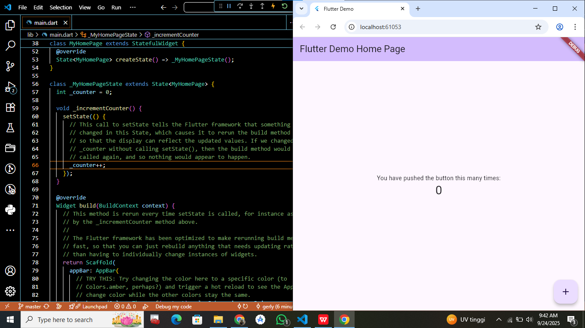
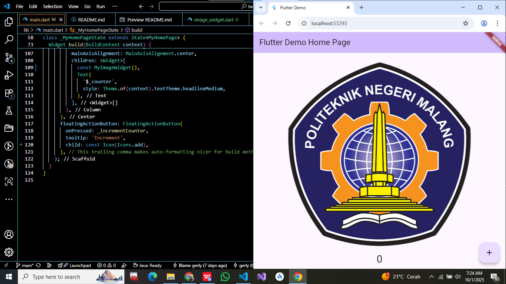

# Jobsheet 4 - Flutter 1

#### Nama: Gerly Vaeyungfan
#### NIM: 2341760195
#### Kelas: SIB-3C
#### No: 14

## Praktikum 1 - Dasar Flutter
Tujuan: Membuat project Flutter pertama dan menjalankan aplikasi Hello World.

### Langkah-langkah
1. Membuat project Flutter baru:
   ```bash 
   flutter create hello_world
2. Masuk ke folder project:
    ```bash
    cd hello_world
3. Menjalankan aplikasi di emulator/Chrome:
    ```bash
    flutter run
#### Hasil: Aplikasi berhasil berjalan dan menampilkan teks Hello World di layar.
## Praktikum 2 - Menjalankan di Device Fisik
Deskripsi singkat: Menjalankan aplikasi Flutter pada perangkat Android.

### Langkah-langkah
1. Hubungkan perangkat Android ke laptop/PC menggunakan kabel USB.
2. Aktifkan Developer Options dan USB Debugging di perangkat Android.
3. Cek apakah device terdeteksi:
    ```bash
    flutter devices
4. Jalankan aplikasi ke device:
    ```bash
    flutter run -d <device_id>
(ganti <device_id> dengan ID device hasil dari flutter devices)
#### Hasil: Aplikasi berhasil berjalan di perangkat Android dengan tampilan Hello World.

## Praktikum 3 - Membuat Repository GitHub dan Laporan Praktikum
A new Flutter project.



## Praktikum 4 - Menerapkan Widget Dasar

### Langkah 1: Text Widget, Import file text_widget.dart ke main.dart


### Langkah 2: Image Widget, Tambahkan file logo Polinema di folder assets project hello_world.



## Praktikum 5 - Menerapkan Widget Material Design dan iOS Cupertino

### Langkah 1: Cupertino Button dan Loading Bar


### Langkah 2: Floating Action Button (FAB)


### Langkah 3: Scaffold Widget


### Langkah 4: Dialog Widget


### Langkah 5: Input dan Selection Widget


### Langkah 6: Date and Time Pickers


## Link Repository github "Codelabs: Your first Flutter app"
https://github.com/gerlyvaeyungfan/flutter-application-1

